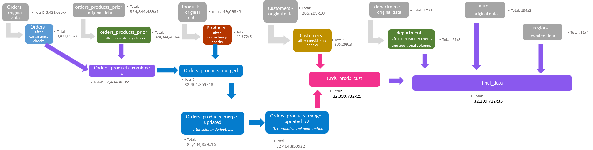
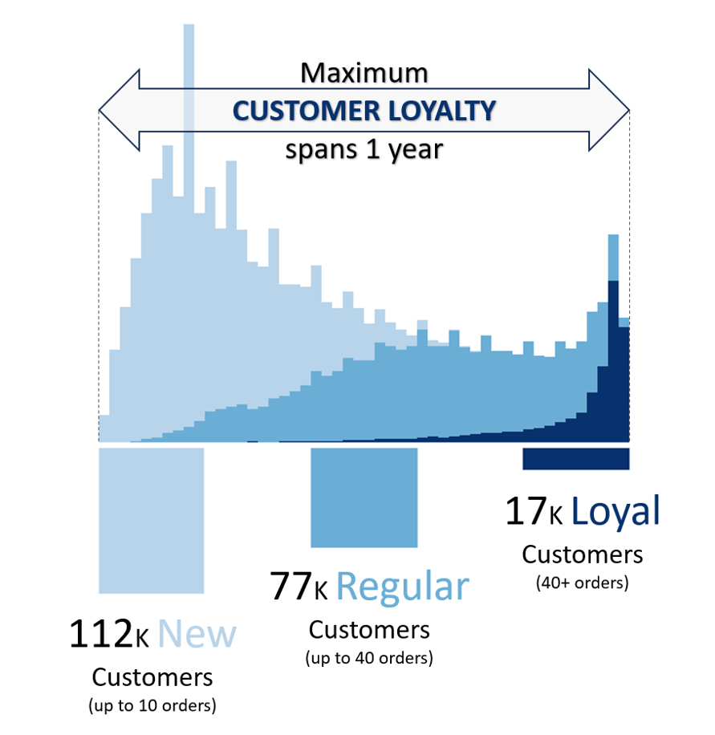

# Python Project:  Instacart Grocery Basket Analysis

  

## Requirements

To execute the Jupyter Notebooks, please consult `03_Scripts/requirements.txt` for the required dependencies.

  

## Links

[Excel Report](05_Sent_to_client/Final_report.xlsx)

  

## Objective

Conduct a data analysis of the company's sales patterns to derive insights and propose strategies for improved customer segmentation addressing the following key questions:

- The sales team needs to know what the busiest days of the week and hours of the day are (i.e., the days and times with the most orders) in order to schedule ads at times when there are fewer orders.
- They also want to know whether there are particular times of the day when people spend the most money, as this might inform the type of products they advertise at these times.
- Instacart has a lot of products with different price tags. Marketing and  sales want to use simpler price range groupings to help direct their efforts.
- Are there certain types of products that are more popular than others?  The marketing and sales teams want to know which departments have the highest frequency of product orders.
- The marketing and sales teams are particularly interested in the different types of customers in their system and how their ordering behaviors differ.

  

## Tools

&nbsp;|&nbsp;|&nbsp;
---|---|---
**Python** | pandas | Data wrangling, cleaning, analysis
&nbsp; | matplotlib seaborn plotly | Visualization
&nbsp;|&nbsp;| &nbsp;
**Excel** |  |Reporting

  

## Data Sets

Provider: Instacart via [Kaggle](https://www.kaggle.com/datasets/psparks/instacart-market-basket-analysis)
- aisles.csv - aisle names
- departments.csv - department names
- orders_products_prior.csv - mapping of product_ids to order_ids
- orders.csv - orders dimension table
- products.csv - products dimension table

Provider: CareerFoundry
- customer.csv - customer dimension table

Own additional data:
- departments2.csv - added a department category column
- usa_regions.csv - states mapped to different regions and short names

  

## Data Transformation / Population Flow

  

## Most Interesting Finding

The following visualization illustrates the duration between customers' first and last order. Notably, the maximum customer tenure spans precisely 1 year, even though the data covers around four years. This observation raises questions about the possibility of a one-year free membership, where even loyal customers may not be willing to pay extra for using the app.

 

For the detailed in-depth analysis refer to the [complete report](05_Sent_to_client/Final_report.xlsx) so as to the [Jupyter Notebooks](03_scripts).